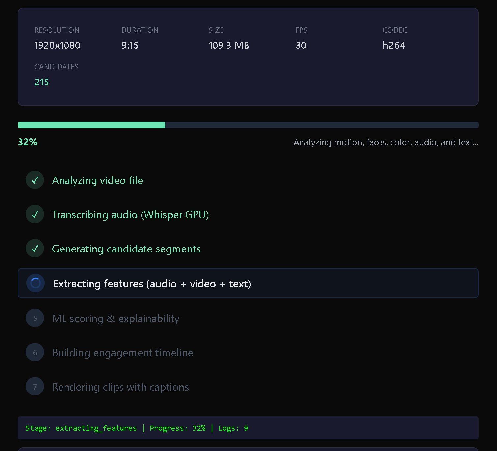
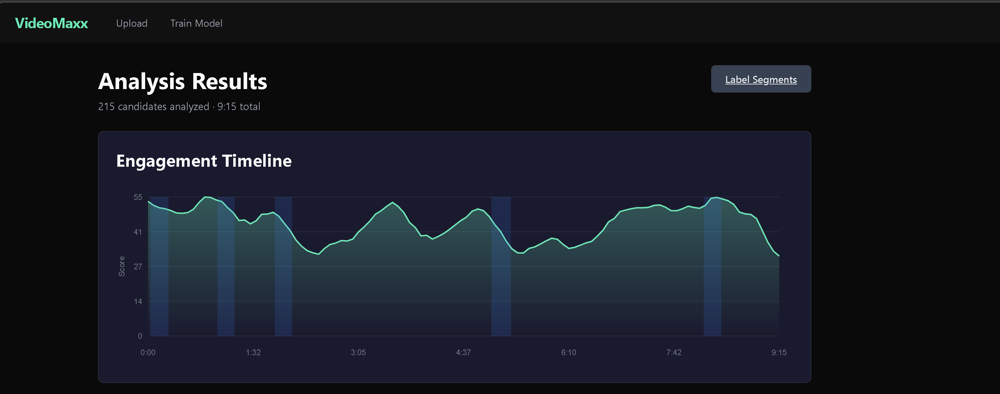
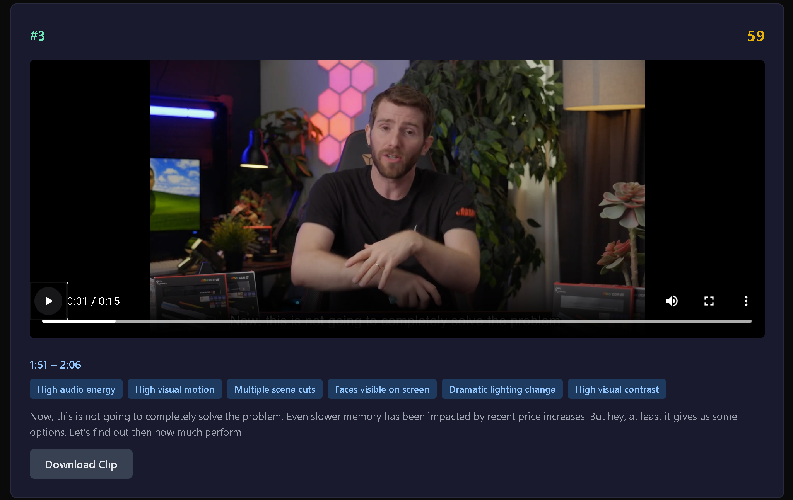
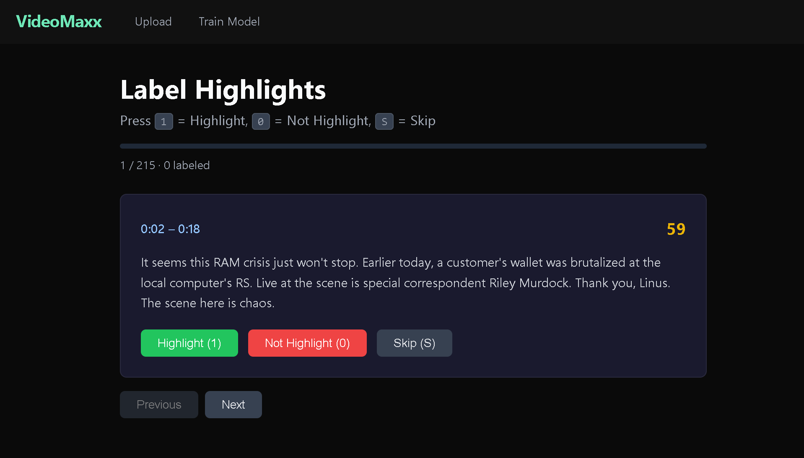

# VideoMaxx — Video Highlight Ranker (Explainable ML)

A local, GPU-accelerated video analysis pipeline that automatically identifies and extracts the most engaging highlights from long-form video content using explainable machine learning.






## Architecture

```
Angular 19 Frontend  <-->  FastAPI Backend  <-->  ML Pipeline
     (port 4200)           (port 8000)          (local GPU/CPU)
```

**Backend Pipeline:**
- **Transcription** — faster-whisper (GPU-accelerated, VAD-filtered)
- **Candidate Generation** — sliding-merge over transcript segments (15–60s windows)
- **Feature Extraction** — sentence-transformers (all-MiniLM-L6-v2) + librosa audio stats
- **ML Scoring** — scikit-learn LogisticRegression with explainable coefficients
- **Clip Rendering** — ffmpeg (cut + subtitle burn)

**Frontend:**
- Upload page with drag-and-drop
- Real-time processing status with stage tracking
- Labeling interface with keyboard shortcuts (1/0/S)
- Results page with engagement timeline chart and clip cards
- Model training dashboard with metrics

## Prerequisites

- **Python 3.11+**
- **Node.js 18+**
- **ffmpeg** on PATH
- **NVIDIA GPU** with CUDA (optional, falls back to CPU)

## Quick Start

### 1. Backend

```bash
# Create venv and install deps
python -m venv venv
venv\Scripts\activate        # Windows
# source venv/bin/activate   # Linux/Mac

pip install -r backend/requirements.txt

# Start server
python run_backend.py
```

Or use `start_backend.bat` (Windows).

### 2. Frontend

```bash
cd frontend
npm install
npx ng serve --open
```

Or use `start_frontend.bat` (Windows).

### 3. Use the App

1. Open `http://localhost:4200`
2. Upload a video — processing runs automatically
3. View engagement timeline and auto-extracted highlight clips
4. Label segments as highlight/not-highlight for training
5. Train the ML model from your labels
6. Re-score videos with the trained model for improved results

## Project Structure

```
VideoMaxx/
├── backend/
│   ├── app.py                 # FastAPI app entry
│   ├── config.py              # Central configuration
│   ├── pipeline/
│   │   ├── transcribe.py      # Whisper transcription
│   │   ├── candidates.py      # Candidate window generation
│   │   ├── features.py        # Combined feature orchestration
│   │   ├── video_features.py  # Video analysis (motion, faces, color, etc.)
│   │   ├── ml.py              # Training, scoring, explainability
│   │   ├── clips.py           # Clip selection & rendering
│   │   └── timeline.py        # Engagement timeline
│   └── routers/
│       ├── jobs.py            # Upload, process, results endpoints
│       ├── labeling.py        # Label management endpoints
│       └── training.py        # Train & re-score endpoints
├── frontend/                  # Angular 19 app
│   └── src/app/
│       ├── services/          # API service
│       └── pages/             # Upload, Status, Label, Results, Train
├── data/                      # Video storage + labels
├── outputs/                   # Per-job outputs (transcripts, clips)
├── ml_artifacts/              # Trained model artifacts
└── run_backend.py             # Uvicorn entry point
```

## ML Details

**Features per candidate segment (38 numeric + 384-d embedding = 422 total):**

| Category | Features | Count |
|----------|----------|-------|
| Text Embedding | all-MiniLM-L6-v2 semantic vector | 384 |
| Text Stats | word count, speaking rate, questions, exclamations, avg word length | 5 |
| Audio Stats | RMS energy (mean/max), spectral centroid, zero-crossing rate | 4 |
| Video Motion | frame differencing (mean/max/std), optical flow (mean/max) | 5 |
| Scene Changes | cuts/sec, scene change score (max/mean), total cuts | 4 |
| Face Detection | presence ratio, face count (mean/max), face area ratio | 4 |
| Brightness/Contrast | brightness (mean/std), contrast (mean/std), max delta | 5 |
| Colorfulness | Hasler-Suesstrunk colorfulness, saturation (mean/std), hue entropy | 4 |
| Visual Complexity | edge density (mean/std), sharpness/Laplacian (mean/min) | 4 |
| Camera Motion | stability, zoom intensity, pan intensity | 3 |

**Model:** LogisticRegression with StandardScaler on numeric features. Before training, a weighted heuristic scorer (video features weighted highest) provides initial rankings. After labeling and training, the model provides probability-based viral scores (0-100) with human-readable explanations derived from both rule-based thresholds and learned coefficients.

**Metrics reported:** ROC AUC, Precision@5

## Tech Stack

| Layer | Technology |
|-------|-----------|
| Frontend | Angular 19, TypeScript, SCSS |
| Backend | FastAPI, Uvicorn, Python 3.11 |
| Transcription | faster-whisper |
| Embeddings | sentence-transformers (all-MiniLM-L6-v2) |
| Audio Analysis | librosa, soundfile |
| ML | scikit-learn, numpy, pandas |
| Video Analysis | OpenCV (motion, faces, color, edges, camera) |
| Video Processing | ffmpeg (subprocess) |
